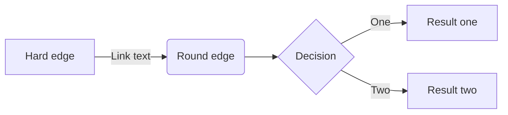
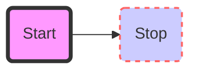
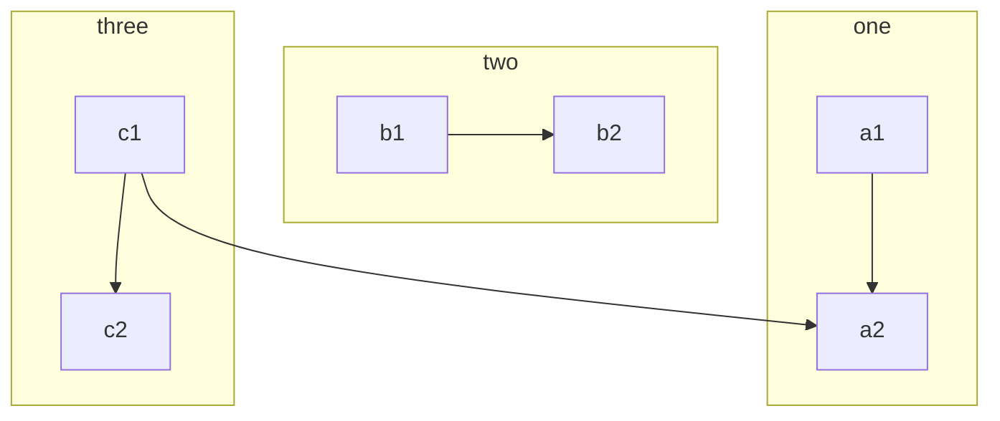

Diagram
========

Here is an example how to include graphs and diagrams rendered by excellent
 [mermaid](http://knsv.github.io/mermaid/).

We can do flow graphs like this one:

or even sequence diagrams:

